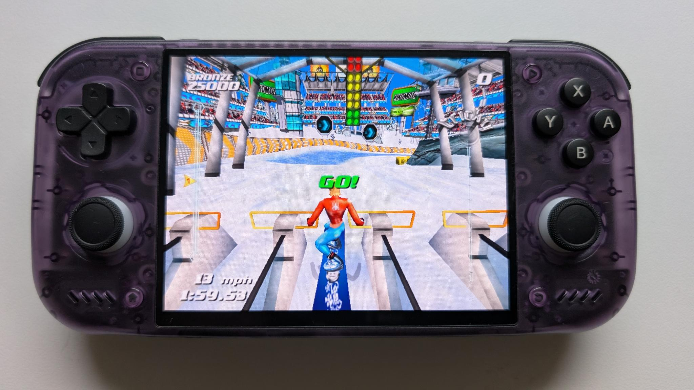

## Guides

I followed Joey's guide on [Joey's Retro Handhelds](https://www.joeysretrohandhelds.com/guides/retroid-pocket-nova-setup-guide/) to configure my Retroid Pocket Nova.

## Hardware

### Micro SD Card

You'll need a micro SD card formatted as exFAT. I started with a 64 GB SD card because I have a small collection of retro games.

## Launchers

### Retroid Launcher

I chose the Retroid's default [Retroid Launcher](https://www.joeysretrohandhelds.com/guides/retroid-launcher-setup-guide/). It's simple and does what I need. [Daijisho](https://daijisho.com/) is another popular launcher with more bells and whistles.

#### Platforms

Retroid Launcher has two main screens, one for viewing Android apps and another for viewing game platforms. The Retroid Launcher guides you through adding platforms to the platform screen during install. Once you link each platform to an emulator and ROM directory you can use the platform view to launch games.

#### Syncing Platform ROMs

For any platform you install you'll need to sync the directory containing your ROMs. Do this by selecting a platform from the platform screen (do not open the platform) and hitting the X button to view platform details. Then you can select and sync directories.

#### Linking Platform Emulators

I installed my chosen emulators before launching any games from the platform view. The first time I played a game for each platform, Retroid prompted me with the option to link my chosen emulator. Now the platform view automatically launches games using my preferred emulators.

#### Removing Duplicate Game Files

I found that copying ROMs to my SD card using Mac's file viewer (Finder) resulted in duplicate game files in the platform view.

This happens because an SD card formatted as exFAT can't hold the file metadata Mac expects when you use Finder. Mac handles this by creating hidden metadata files when you copy ROMs to the exFAT SD card using Finder. These hidden files are created with the same extension as the copied file and get displayed alongside the actual game file in Retroid's platform view, creating the appearance of duplicate games.

If you're comfortable with Mac's command line interface you can remove the hidden metadata files by running the commands below after copying ROMs to exFAT SD card. (Replace `{volumeName}` with the name that shows up in Finder.)

```shell
find /Volumes/{volumeName} -name "._*" -delete
find /Volumes/{volumeName} -name ".DS_Store" -delete
```

## Emulators

### Obtanium

I'm using [Obtanium]() to manage emulator updates. Joey's [Obtanium Setup Guide](https://www.joeysretrohandhelds.com/guides/obtainium-setup-guide/) provides a formatted [list](https://github.com/JoeysRetroHandhelds/joeys-obtainium/releases/latest) of common emulators you can import to get started.

### Dolphin

I picked [Dolphin](https://dolphin-emu.org/) for GameCube emulation. Below are the quirks I found along the way.

#### Fixing Game Lag

At first, every game's graphics and audio played at about half speed. Switching the GameCube video backend from OpenGL to Vulkan resolved this.

<div class="alert alert-info" role="alert">
Settings > Graphics Settings > Video Backend > Vulkan
</div>

#### Removing Button Overlays

By default, controller buttons are set to overlay the game screen. Turn this off by toggling overlay controls via the in-game Dolphin menu. (This is the same menu used to exit the emulator while playing a game.) Access this menu by hitting the handheld's back button while playing a game.

<div class="alert alert-info" role="alert">
In-game Settings > Toggle Controls > Toggle All
</div>

#### Mapping Buttons

You'll need to manually map Retroid's buttons to their GameCube counterparts. To do this, select *GameCube Input* and then press the settings gear icon for controller 1.

<div class="alert alert-info" role="alert">
Settings > GameCube Input > GameCube Controller 1 Settings (gear icon) > Buttons
</div>

## Other Gotchas

### Removing the Vertical White Line

By default, a vertical white line displays on the right side of the screen while playing games. This is Retroid's *Floating Icon* feature which provides quick in-game access to system information. You can disable this feature by swiping down from the top of the screen (make sure you swipe twice to get the full menu), scrolling right, and deselecting *Floating Icon*.
